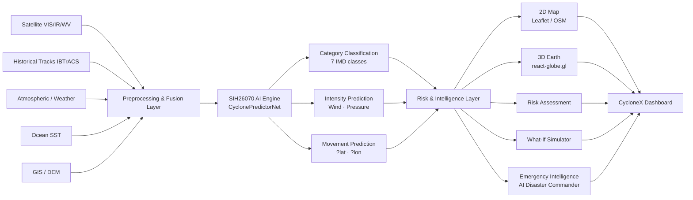

# CycloneX

**AI-Powered Cyclone Intelligence & Emergency Decision-Support System**

> SIH 2026 · Problem Statement **SIH26070**
> *AI/ML-based identification, classification and prediction of tropical cyclone patterns using multi-source satellite and environmental data*

---

## Problem Statement

Tropical cyclones in the Bay of Bengal are among the most destructive natural events affecting India's eastern coastline. Accurate and timely intelligence about cyclone intensity, movement, and landfall risk is essential for effective emergency response.

**SIH26070** challenges teams to:

- Identify and classify tropical cyclone patterns from multi-source data
- Predict cyclone intensity (wind, pressure) and movement using AI/ML
- Present actionable intelligence for emergency decision-makers

Core difficulties:

| Challenge | Description |
|-----------|-------------|
| Multi-modal data | Satellite imagery, atmospheric soundings, ocean temperatures, and historical tracks must be fused |
| Temporal complexity | Cyclone evolution requires analysis of sequential observations, not just snapshots |
| High dimensionality | Raw satellite channels (VIS/IR/WV) are large and require preprocessing |
| Operational urgency | Raw model outputs must be translated into actionable priorities for responders |

---

## CycloneX Solution

CycloneX is an integrated cyclone intelligence platform that ingests multi-source data, runs AI/ML inference, and translates outputs into interactive visualization and emergency decision support.

```
Multi-Source Data (Satellite · Weather · Ocean · Historical)
                          ?
               Data Preprocessing & Fusion
                          ?
         SIH26070 AI/ML Cyclone Intelligence Engine
                          ?
     +--------------------------------------------+
     ?              ?              ?              ?
Classification  Intensity      Movement      Risk Layer
  (7-class)     (Wind/Pres)    (?lat, ?lon)
     +--------------------------------------------+
                          ?
         Interactive 2D Map + 3D Earth Visualization
                          ?
         Emergency Intelligence & Decision Support
```

---

## Key Features

### ? Implemented & Testable

| Feature | Description |
|---------|-------------|
| **Interactive 2D Map** | Leaflet/OSM-based map with country, state, and city labels — no API key required |
| **Interactive 3D Earth** | `react-globe.gl` globe with geographic labels, cyclone visualization, and track display |
| **2D ? 3D Toggle** | Switching between views preserves the same shared cyclone state |
| **Cyclone Visualization** | Eye/center marker, animated circulation rings (radius/speed scale with wind intensity), observed track, AI prediction line, scenario track |
| **AI Model Integration** | Live inference via local SIH26070 PyTorch model — wind, pressure, ?lat, ?lon, category |
| **SIH26070 AI Output Panel** | Dashboard displays predicted wind, pressure, movement delta, and model status |
| **Prediction Panel** | Side-by-side display: Observed Data vs AI Model Output (one-step), plus downstream scenario chart |
| **What-If Simulator** | Adjust cyclone intensity and track deviation; changes propagate to map, risk, emergency panels |
| **Risk Assessment** | Wind, flood, surge, infrastructure, population exposure — derived from cyclone parameters |
| **AI Disaster Commander** | Converts cyclone + risk data into prioritised emergency actions |
| **Multi-Source Panel** | Detailed ingestion status for satellite, weather, ocean, historical, and GIS data |
| **ML Pipeline Panel** | Displays preprocessing steps, model architecture summary, and inference flow |
| **Status Cards** | Cyclone status, classification, wind, pressure, AI-predicted wind/pressure, movement, model online/offline |
| **Demo Replay** | PLAY / PAUSE / RESET — cyclone moves along historical track; map and 3D globe follow |
| **Data Mode Switch** | REAL DATA / DEMO REPLAY — explicitly separate; never conflated |

### ?? Demo / Historical Replay

| Feature | Notes |
|---------|-------|
| Demo cyclone "Varun" | Fictional scenario for demonstration — not a real cyclone |
| Historical track replay | Deterministic, reproducible for judging/demo environments |
| Satellite frames | Historical NASA GIBS (MODIS) frames for Cyclone Michaung (2023-12-04) — labeled HISTORICAL |
| Scenario simulation | What-If tracks and risk changes are scenario estimates, not validated forecasts |

### ?? Partial / Estimated

| Feature | Notes |
|---------|-------|
| Hospital preparedness | Displayed in DEMO mode; shows DATA UNAVAILABLE in REAL mode (no live hospital DB integrated) |
| Communication risk | Displayed in DEMO mode; shows DATA UNAVAILABLE in REAL mode |
| Evacuation shelters | Displayed in DEMO mode; shows DATA UNAVAILABLE in REAL mode |
| Population exposure | Scenario estimate, not real census-linked computation |

### ?? Future Scope

Multi-step validated forecasting, probabilistic forecast cones, live INSAT-3DR ingestion, operational alert integration — see Future Scope section.

---

## Interactive 2D + 3D Map

### 2D Map (Leaflet + OpenStreetMap)

- **No API key required** — uses free OpenStreetMap tile servers
- Country, state, and city labels rendered by the tile layer at appropriate zoom levels
- Cyclone center, name, wind, pressure shown via popup/tooltip
- **Observed track** — solid line (historical positions)
- **AI SIH26070 one-step prediction** — thick dashed red line from current position
- **Scenario track** — dashed orange line when What-If is active
- Risk zones as coloured circles (High / Medium / Low)
- Baseline reference zones shown as dashed outlines when scenario differs from baseline
- Legend for all active layers
- Nearby cities with risk-coded markers

### 3D Earth (react-globe.gl / Three.js)

- Blue Marble satellite texture with terrain bump mapping
- Night sky background; atmospheric glow effect
- Geographic labels: country names (India, Sri Lanka, Bangladesh, Myanmar), major city names — anchored at real lat/lon coordinates
- **Auto-centers on active cyclone** when opened — altitude 0.6, showing regional geography
- **Animated circulation rings** — radius and propagation speed scale dynamically with current wind speed (labeled `DEMO METEOROLOGICAL VISUALIZATION`)
- Observed track — blue path
- AI one-step prediction — animated dashed red path
- What-If scenario track — animated dashed orange path (only visible when scenario is active)
- HTML overlay at cyclone center: category, wind, pressure

### Shared State

Both map views read from a single `SimulationContext`. Cyclone position, track data, AI prediction, and scenario state are never duplicated between 2D and 3D.

---

## Multi-Source Data Pipeline

| Source | Role | Status |
|--------|------|--------|
| **Satellite (VIS/IR/WV)** | Multi-spectral imagery for convective pattern analysis | SAMPLE (NASA GIBS historical frames for Michaung 2023) |
| **Atmospheric / Weather** | Wind, pressure, humidity, shear, vorticity | LIVE (Open-Meteo public API) in REAL mode; SAMPLE profile in DEMO mode |
| **Ocean SST** | Sea surface temperature — cyclone intensification driver | SAMPLE (29.4°C demonstration value) |
| **Historical Tracks (IBTrACS)** | Historical cyclone track analogs | READY (referenced in service layer) |
| **GIS / DEM** | Geographic context for impact analysis | READY (OpenStreetMap / react-globe.gl geometry) |

> **Data honesty rule enforced in code:** Every data point carries a `sourceStatus` field (`LIVE`, `HISTORICAL`, `SAMPLE_DATA`, `UNAVAILABLE`). The UI displays this status explicitly alongside every data panel.

---

## SIH26070 AI/ML Model

### Architecture

The model (`CyclonePredictorNet`) is a multimodal PyTorch neural network combining satellite imagery and temporal track data.

```
Input A: Satellite Image  [B, 4, 201, 201]
Input B: Track Sequence   [B, 9, 5]

 ImageEncoder                    TrackEncoder
 +------------------+            +------------------+
 ¦ Conv stem (4?32) ¦            ¦ Bi-LSTM(5?128)   ¦
 ¦ ConvBlock 32?64  ¦            ¦ 2 layers          ¦
 ¦ ConvBlock 64?128 ¦            ¦ dropout 0.1       ¦
 ¦ ConvBlock 128?256¦            ¦ Linear proj?128   ¦
 ¦ ConvBlock 256?256¦            +------------------+
 ¦ ChannelAttention ¦                     ¦
 ¦ AdaptiveAvgPool  ¦                     ¦
 +------------------+                     ¦
          ¦ 256-dim                        ¦ 128-dim
          +-------------------------------+
                    Concatenate [384]
                         ?
                  Shared MLP Head
                  Linear(384?256) + LayerNorm + GELU + Dropout(0.2)
                  Linear(256?128) + LayerNorm + GELU
                         ?
          +--------------+-----------------------------+
          ?              ?              ?              ?
    Wind (1)      Pressure (1)    Track (2)     Category (7)
   km/h scalar    hPa scalar    [?lat, ?lon]  Softmax over
                                               7 IMD classes
```

### Input Features

**Image tensor** `[B, 4, 201, 201]`:  
4-channel multi-spectral satellite patch (e.g., VIS, IR1, IR2, WV) centred on the cyclone.

**Track sequence** `[B, 9, 5]`:  
9 historical timesteps × 5 features per step:

| Index | Feature |
|-------|---------|
| 0 | Latitude (°N) |
| 1 | Longitude (°E) |
| 2 | Wind speed (km/h) |
| 3 | Central pressure (hPa) |
| 4 | Hours elapsed |

### Output Heads

| Head | Shape | Description |
|------|-------|-------------|
| `wind` | scalar | Predicted maximum sustained wind (km/h) |
| `pressure` | scalar | Predicted central pressure (hPa) |
| `track` | [?lat, ?lon] | One-step movement delta |
| `category` | 7-class logits | IMD cyclone category classification |

**IMD Category mapping:**

| Index | Category |
|-------|----------|
| 0 | Depression (D) |
| 1 | Deep Depression (DD) |
| 2 | Cyclonic Storm (CS) |
| 3 | Severe Cyclonic Storm (SCS) |
| 4 | Very Severe Cyclonic Storm (VSCS) |
| 5 | Extremely Severe Cyclonic Storm (ESCS) |
| 6 | Super Cyclonic Storm (SuCS) |

### Training

- **Framework:** PyTorch
- **Trained on:** Kaggle (SIH26070 training environment)
- **Checkpoint:** `best_model.zip` (not committed to repository — see Model Artifact section)
- **Performance metrics:** Formal published metrics are not included in the current prototype documentation.

### ?? Important Model Limitation

The SIH26070 model produces a **single forward step** prediction based on the 9-step historical track window. It does **not** inherently produce a continuous hourly 24-hour forecast cone. The downstream scenario timeline shown in the Prediction panel is a **derived simulation** for visualization purposes — it is not a validated multi-step forecast output. These are clearly labeled separately in the UI.

---

## Inference Pipeline

```
1. Observed cyclone data (lat, lon, wind, pressure, time)
         ?
2. Build 9-step track tensor  [1, 9, 5]
         ?
3. Mock/real satellite patch  [1, 4, 201, 201]
         ?
4. POST /api/ai/predict  (Node proxy ? FastAPI ? PyTorch)
         ?
5. CyclonePredictorNet forward pass (~60ms on CPU)
         ?
6. Structured response: { wind, pressure, delta_lat, delta_lon, category }
         ?
7. SimulationContext updates ? propagates to:
         Dashboard ? Map ? Prediction ? Risk ? Emergency panels
```

> **Note:** In the current local prototype, the satellite input is a randomly initialised tensor. Integrating real preprocessed satellite patches from `scripts/satellite_preprocessing_pipeline.py` is the next milestone.

---

## What-If Simulator

The What-If Simulator lets users explore how changes in cyclone intensity or track deviation affect downstream outputs.

**Controls:**
- **Intensity delta (%)** — amplifies or reduces wind speed and risk calculations
- **Track shift (km)** — displaces the forecast track laterally

**Propagation (implemented):**

```
Baseline State
      ?
What-If Modification
      ?
Shared Scenario State (SimulationContext)
      ?
  +-------------------------------------------+
  ?          ?          ?          ?          ?
Dashboard  2D Map    3D Earth  Risk Panel  Emergency
```

**Distinction:**  
> What-If scenarios are exploratory simulations — they are **not** scientifically validated forecasts. The UI displays "SIMULATED SCENARIO" whenever a scenario is active and "BASELINE SCENARIO" when reset.

---

## Risk Assessment

Risk indicators are derived from the cyclone intensity and scenario state — they are scenario-based estimates, not measured real-world values.

| Risk Indicator | Status | Basis |
|----------------|--------|-------|
| Wind Risk | ? Implemented | Derived from wind speed threshold bands |
| Flood Risk | ? Implemented | Derived from wind + coastal proximity |
| Storm Surge Risk | ? Implemented | Derived from intensity and coastal exposure |
| Infrastructure Risk | ? Implemented | Wind-speed-based infrastructure vulnerability estimate |
| Population Exposure | ?? Demo | Scenario estimate (not live census data) |
| Hospital Preparedness | ?? Demo only | Shows DATA UNAVAILABLE in REAL mode |
| Communication Risk | ?? Demo only | Shows DATA UNAVAILABLE in REAL mode |
| Evacuation Priority | ?? Demo only | Shows DATA UNAVAILABLE in REAL mode |

---

## AI Disaster Commander

The Emergency Intelligence panel converts available cyclone and risk data into prioritised operational insights.

**Outputs:**
- Threat level (LOW / MODERATE / HIGH / CRITICAL)
- Top response priorities ranked by urgency
- Affected population estimate (Demo mode)
- Critical infrastructure alerts
- Hospital and communication readiness (Demo mode)
- Evacuation priority assessment (Demo mode)

> **AI-assisted decision support — NOT an official government warning.**  
> CycloneX is a prototype system. Emergency response decisions must follow directives from the India Meteorological Department (IMD), National Disaster Management Authority (NDMA), and State Disaster Management Authorities.

---

## REAL DATA vs DEMO REPLAY

| | REAL DATA Mode | DEMO REPLAY Mode |
|-|----------------|-----------------|
| **Atmospheric data** | Live Open-Meteo API fetch | Fixed sample profile |
| **Satellite** | NASA GIBS historical (no active cyclone today) | Michaung 2023 historical frames |
| **Cyclone position** | No active Bay of Bengal cyclone — demo coordinates used | "Cyclone Varun" (fictional) historical track |
| **AI inference** | Live local PyTorch model (requires `best_model.zip`) | Same local model |
| **Risk values** | Derived from live data where available | Derived from demo profile |
| **Hospital/Shelter/Comm** | DATA UNAVAILABLE (no real DB) | Demo estimates |

**Why DEMO REPLAY exists:**
- Reproducible, deterministic demonstration for judges
- Works offline without active cyclone events
- Allows systematic feature walkthrough
- Verifiable against historical Cyclone Michaung (2023) case

---

## System Architecture



---

## Technology Stack

| Layer | Technology |
|-------|------------|
| **Frontend** | React 19 + TypeScript + Vite 8 |
| **Styling** | Tailwind CSS v4 |
| **2D Mapping** | Leaflet + react-leaflet (OpenStreetMap tiles — no API key) |
| **3D Globe** | react-globe.gl + Three.js |
| **Charts** | Recharts |
| **Icons** | lucide-react |
| **Backend Gateway** | Node.js + Express (proxy server) |
| **ML API** | Python + FastAPI + Uvicorn |
| **AI/ML Framework** | PyTorch |
| **Atmospheric Data** | Open-Meteo public API (free, no key) |
| **Satellite Data** | NASA GIBS (historical MODIS frames) |
| **Deployment (Frontend)** | Vercel (configured via `vercel.json`) |
| **Deployment (Backend)** | Render / Railway (manual setup required) |

---

## Project Structure

```
CycloneX/
+-- backend/
¦   +-- ml/
¦   ¦   +-- api.py               # FastAPI ML inference server
¦   ¦   +-- predictor.py         # CyclonePredictorNet model architecture
¦   ¦   +-- requirements.txt     # Python dependencies
¦   +-- services/api/            # Additional backend service stubs
¦   +-- server.js                # Node.js gateway (weather, satellite, AI proxy)
¦
+-- scripts/
¦   +-- satellite_preprocessing_pipeline.py   # Satellite preprocessing utility
¦
+-- src/
¦   +-- components/
¦   ¦   +-- AIDisasterCommander.tsx            # Emergency intelligence panel
¦   ¦   +-- CommunicationRisk.tsx              # Communication risk module
¦   ¦   +-- CycloneAnalysisPanel.tsx           # Cyclone analysis tab
¦   ¦   +-- CycloneMap.tsx                     # 2D/3D map container (with replay)
¦   ¦   +-- DataSourcesPanel.tsx               # Data sources display
¦   ¦   +-- EvacuationShelter.tsx              # Evacuation priority panel
¦   ¦   +-- GlobeMap.tsx                       # 3D Earth (react-globe.gl)
¦   ¦   +-- HospitalPreparedness.tsx           # Hospital readiness panel
¦   ¦   +-- MLPipelinePanel.tsx                # ML pipeline status display
¦   ¦   +-- MultiSourceIntelligence.tsx        # Multi-source data intelligence
¦   ¦   +-- PredictionPanel.tsx                # Prediction: observed vs AI vs scenario
¦   ¦   +-- RiskAssessmentPanel.tsx            # Risk assessment
¦   ¦   +-- Sidebar.tsx                        # Navigation sidebar
¦   ¦   +-- StatusCards.tsx                    # Top-level status (incl. AI outputs)
¦   ¦   +-- TopBar.tsx                         # Mode selector + branding
¦   ¦   +-- WhatIfSimulator.tsx                # What-If scenario simulator
¦   ¦   +-- ui.tsx                             # Shared UI primitives
¦   +-- context/
¦   ¦   +-- SimulationContext.tsx              # Single shared application state
¦   +-- data/
¦   ¦   +-- demoData.ts                        # Demo scenario data (clearly labeled)
¦   +-- models/
¦   ¦   +-- cycloneObservation.ts              # Data model types
¦   ¦   +-- mlPipelineTypes.ts                 # ML pipeline type definitions
¦   +-- services/
¦   ¦   +-- fusion/dataFusionEngine.ts         # Multi-source data fusion
¦   ¦   +-- ingestion/                         # Satellite / weather / ocean / historical services
¦   ¦   +-- ml/prototypePipeline.ts            # Frontend ML pipeline orchestration
¦   ¦   +-- preprocessing/                     # Satellite preprocessing
¦   ¦   +-- quality/sourceStatusTracker.ts     # Data source quality tracking
¦   +-- utils/simulation.ts                    # Simulation engine (What-If math)
¦   +-- types.ts                               # Global type definitions
¦
+-- .env.example                 # Environment variable documentation
+-- vercel.json                  # Vercel frontend deployment config
+-- vite.config.ts               # Vite dev server + API proxy config
+-- package.json
+-- README.md
```

---

## Model Artifact

The trained `best_model.zip` checkpoint is **not committed to this repository** because:

1. It is a large binary artifact
2. It may contain training-environment-specific state
3. GitHub is not suitable for ML model storage

**For local development:** Place `best_model.zip` at any path and set `MODEL_PATH` accordingly.

**For production:** Host the artifact on Hugging Face Hub, cloud storage (S3/GCS), or a service with persistent disk (Render with disk attachment) and provide the `MODEL_PATH` environment variable to the running server.

---

## Local Development

### Prerequisites

- Node.js 18+
- Python 3.10+
- PyTorch 2.x
- `best_model.zip` (training artifact — see above)

### 1. Frontend

```bash
npm install
npm run dev
# Opens at http://localhost:5173
```

### 2. Node Gateway (Backend Proxy)

```bash
npm run start:api
# Starts Express server on port 8000
# Proxies /api/ai/* ? Python ML API at 127.0.0.1:8001
# Fetches /api/data/weather from Open-Meteo
# Serves /api/data/satellite/* historical frames
```

### 3. Python ML API

```bash
cd backend/ml
pip install -r requirements.txt

# Set model path (adjust to your actual path)
$env:MODEL_PATH = "C:\path\to\best_model.zip"    # PowerShell
export MODEL_PATH=/path/to/best_model.zip          # bash

python api.py
# FastAPI + Uvicorn on http://127.0.0.1:8001
```

### 4. Test Inference

```bash
# Check model health
curl http://127.0.0.1:8001/health

# Run a prediction (via Node proxy)
curl -X POST http://localhost:8000/api/ai/predict \
  -H "Content-Type: application/json" \
  -d '{"track_sequence": [[16.9,83.6,110,970,0],[16.2,84.1,105,973,6],[15.4,84.6,95,977,12],[14.6,85.2,85,982,18],[13.8,85.9,75,988,24],[13.0,86.4,65,993,30],[12.3,86.8,58,997,36],[11.7,87.1,52,1001,42],[11.2,87.3,46,1005,48]]}'
```

### Production Build

```bash
npm run build   # TypeScript check + Vite production build ? dist/
```

---

## Environment Variables

| Variable | Where | Required | Purpose |
|----------|-------|----------|---------|
| `VITE_API_BASE_URL` | Frontend (Vercel) | Production only | URL of deployed Node backend e.g. `https://cyclonex-api.onrender.com` |
| `FRONTEND_ORIGIN` | Backend (Render) | Production only | Allowed CORS origin e.g. `https://cyclonex.vercel.app` |
| `MODEL_PATH` | Python ML API | Required | Filesystem path to `best_model.zip` |
| `PORT` | Node backend | Optional | Default `8000` |

> Never commit actual values. Copy `.env.example` to `.env` for local development.

---

## Deployment Architecture

```
User Browser
     ?
Vercel (Frontend — static React SPA)
     ? /api/* requests
VITE_API_BASE_URL (production only)
     ?
Render / Railway (Node.js Gateway — backend/server.js)
     ? Weather/Satellite fetches
Open-Meteo · NASA GIBS (external public APIs — no key)
     ? /api/ai/predict
Python FastAPI (127.0.0.1:8001 — same host or sidecar)
     ?
CyclonePredictorNet (best_model.zip loaded into memory)
```

**Current status:**
- Frontend push to `main` triggers automatic Vercel redeploy
- Node backend and Python ML API require manual deployment to a persistent server (Render, Railway, or similar)
- `VITE_API_BASE_URL` must be set in Vercel project settings once the backend is deployed

---

## Validation & Testing

| Test | Status |
|------|--------|
| TypeScript compilation | ? Passes (`tsc -b`) |
| Production Vite build | ? Passes (2789 modules, no errors) |
| Model loading (local) | ? Verified — loads `best_model.zip`, prints `[ML-API] Model loaded successfully.` |
| Model inference | ? Verified — ~60ms CPU inference, returns valid JSON payload |
| API health endpoint | ? `GET /health` on Node (port 8000) and FastAPI (port 8001) |
| 2D map rendering | ? OSM tiles load, tracks and markers render correctly |
| 3D Earth rendering | ? Globe loads, auto-centers on cyclone, tracks visible |
| 2D ? 3D sync | ? Same `SimulationContext` state, verified by shared `activeCenter` prop |
| What-If propagation | ? Sliders update dashboard, map, prediction chart, risk, emergency panels |
| Demo Replay | ? PLAY/PAUSE/RESET working; `flyTo` map animation follows track |
| REAL vs DEMO separation | ? Enforced at service layer via `sourceStatus` and explicit UI labels |
| Mobile layout | ? Responsive Tailwind grid; 3D globe handles touch via Three.js OrbitControls |

---

## Limitations

| Limitation | Notes |
|------------|-------|
| One-step AI prediction | The model produces a single forward step, not a continuous 24-hour forecast |
| No live satellite ingestion | Real-time INSAT-3DR/MOSDAC streams are not integrated in this prototype |
| Mock satellite input to model | The satellite tensor passed to the model is a random initialisation; real preprocessed patches would improve output quality |
| Demo geographic data | "Cyclone Varun" is fictional; risk estimates are not real-world validated |
| No operational validation | The system has not been benchmarked against IMD or JTWC operational forecasts |
| Model hardware | Training was on Kaggle GPU; local CPU inference works but is slower |
| Hospital/shelter/comm databases | No live government infrastructure databases are integrated |

---

## Future Scope

- Multi-step trajectory forecasting with probabilistic uncertainty cones
- Integration of real-time INSAT-3DR data via MOSDAC/IMD APIs
- Real preprocessed satellite patches as model input
- Ensemble-based uncertainty estimation
- Automated IBTrACS analog matching for track prediction
- Verified infrastructure exposure databases (OSM / NDMA datasets)
- Integration with IMD/NDMA official alert systems (read-only)
- Rigorous benchmarking against operational forecast baselines
- Extended training with larger and more diverse Bay of Bengal cyclone datasets
- Expanded geographic coverage beyond Bay of Bengal

---

## Data Attribution

| Source | Usage |
|--------|-------|
| OpenStreetMap contributors | 2D map tiles (free, no key) |
| NASA GIBS / Terra-MODIS / Aqua-MODIS | Historical satellite imagery for Cyclone Michaung 2023 |
| Open-Meteo | Live atmospheric observations (REAL DATA mode) |
| IBTrACS (NOAA/WMO) | Historical cyclone track reference |
| SIH26070 Kaggle dataset | Model training data |
| react-globe.gl / unpkg | Blue Marble texture (`three-globe`) |

---

## Responsible Use

CycloneX is a prototype decision-support system developed for **SIH 2026** under Problem Statement **SIH26070**.

AI predictions are intended to support analysis, research, and demonstration.

**The system is not a replacement for official meteorological agencies, emergency authorities, or government warnings.**

All risk and emergency outputs carry the explicit disclaimer:
> *"AI-assisted decision support — NOT an official government warning."*

---

## Demo Walkthrough

1. Open CycloneX Dashboard at `http://localhost:5173`
2. Select **DEMO REPLAY** (top-right toggle) for a reliable demonstration
3. Inspect the **Status Cards** — cyclone classification, wind, pressure, AI model outputs
4. View the **Multi-Source Inputs** banner — satellite, SST, atmosphere, IBTrACS, GIS
5. Observe the cyclone on the **2D Map** — center marker, observed track, AI prediction (red dashed)
6. Press **Play** on DEMO REPLAY controls — watch the cyclone move along the historical track
7. Switch to **3D Earth** — globe auto-centers on cyclone, circulation rings animate
8. Navigate to **Cyclone Analysis** — classification detail, intensity timeline
9. Navigate to **Prediction** — observe the "AI MODEL OUTPUT (One-Step)" vs "OBSERVED DATA" comparison, and the downstream scenario chart
10. Navigate to **What-If Simulator** — increase intensity by 20%, observe map and risk updates
11. Navigate to **Risk Assessment** — review wind/flood/surge/infrastructure risk indicators
12. Navigate to **Emergency Intelligence** — review AI Disaster Commander priorities
13. Press **Reset to Baseline** in What-If — verify all views return to baseline

---

## Repository

**GitHub:** [https://github.com/kvarshini17/CycloneX](https://github.com/kvarshini17/CycloneX)  
**Branch:** `main`  
**Last commit:** `Integrate SIH26070 AI cyclone intelligence`
