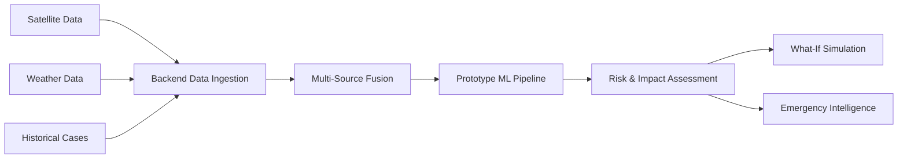

# CycloneX

AI-Powered Cyclone Intelligence & Emergency Decision-Support System

**Smart India Hackathon 2026**
**Problem Statement ID:** SIH26070
**Theme:** Disaster Management
**Category:** Software
**Team:** The Apex Crew

---

## 1. SIH Problem Statement
"To develop an Artificial Intelligence (AI) / Machine Learning (ML) based system for identification, classification, and prediction of different tropical cyclone patterns using multi-source satellite data."

## 2. Problem Understanding
Tropical cyclones are highly complex meteorological phenomena. Traditional forecasting relies on human interpretation of satellite imagery or computationally expensive numerical weather prediction (NWP) models. The core challenge is synthesizing heterogeneous, high-dimensional multi-source data (satellite infrared, visible, water vapour bands, alongside marine weather, SST, and atmospheric parameters) into a cohesive, fast, and actionable predictive pipeline for disaster management authorities.

## 3. Proposed Solution
CycloneX is an end-to-end intelligence and decision-support platform. It automatically ingests data from diverse meteorological sources, fuses them into a unified feature vector, runs it through an evaluation pipeline, and translates meteorological outputs into actionable emergency protocols. It bridges the gap between raw scientific data and on-the-ground disaster response.

## 4. Features
- **Interactive Map:** Leaflet-based geographic visualization. (✅ Implemented)
- **Multi-Source Data:** Ingestion of satellite imagery alongside marine weather observations. (✅ Implemented)
- **Satellite Imagery:** Playback and analysis of multi-band satellite data. (✅ Implemented)
- **Weather Analysis:** Live wind speed, pressure, temperature, and humidity. (✅ Implemented)
- **Visual Prediction:** Area charts predicting track and intensity. (✅ Implemented)
- **Risk Assessment:** Dynamic scoring of localized risks. (✅ Implemented)
- **What-If Simulator:** Interactive controls to adjust hypothetical scenarios. (✅ Implemented)
- **Emergency Intelligence:** Decision-support triage recommendations. (✅ Implemented)
- **REAL DATA vs DEMO REPLAY modes.** (✅ Implemented)

## 5. Multi-Source Intelligence
CycloneX fuses data from multiple domains: satellite observations for structural features, atmospheric conditions (wind, pressure) for ground truth intensity, ocean conditions (SST) as the thermodynamic driver, and historical analogs. This multi-modal approach creates a 19-dimensional "Fused Feature Vector" that provides higher confidence estimates than any single source.

## 6. Satellite Data
- **Provider:** NASA GIBS (Global Imagery Browse Services)
- **Products:** Terra/MODIS, Aqua/MODIS
- **Purpose:** Cloud-top temperature extraction, eye definition assessment, and visual monitoring.
- **Status:** Consumed via historical replay fetch mechanism for the Michaung 2023 case study, overlaying frames dynamically within the dashboard.

## 7. Historical Data
- **Status:** (🔧 Planned) Full dynamic IBTrACS integration.
- **Purpose:** Designed to use historical best-track data (NOAA IBTrACS) to conduct analog analysis. Currently demonstrated via static reference points in the frontend (`demoData.ts`).

## 8. Weather / Environmental Data
- **Provider:** Open-Meteo Public Weather API (Marine/Coastal query)
- **Variables:** Wind Speed (10m), Wind Gusts, Surface Pressure, Temperature (2m), Relative Humidity.
- **Status:** (✅ Implemented) In REAL DATA mode, the Node.js backend proxies a live request to Open-Meteo, extracting OBSERVED or near-real-time estimated parameters to feed the ML pipeline.

## 9. AI / ML Architecture
*Current implementation contains a prototype model architecture; the full trained forecasting pipeline is planned/future work.*
The repository contains a `prototypePipeline.ts` (TypeScript) acting as an architectural stand-in for the future Python-based deep learning backend. It uses deterministic heuristic algorithms to mimic a trained model and successfully models the *data contracts* required by the frontend.

## 10. Detection
**(🟡 Prototype / Partial)** Evaluates cloud-top minimum temperature, eye definition, and atmospheric vorticity heuristics to output a binary detection status and confidence interval. 

## 11. Classification
**(🟡 Prototype / Partial)** Maps wind speed and pressure deficit features against the official India Meteorological Department (IMD) intensity scale.

## 12. Intensity
**(🟡 Prototype / Partial)** Estimates Rapid Intensification (RI) risk by cross-referencing Sea Surface Temperature (SST) favorability with vertical wind shear.

## 13. Track Prediction
**(🟡 Prototype / Partial)** Projects a 24-hour trajectory, uncertainty cone radius, and estimated landfall point based on static physics-informed baseline trajectories.

## 14. REAL DATA vs DEMO REPLAY
- **REAL DATA:** Retrieves the latest live marine weather data via the Open-Meteo API. The simulation engine dynamically overrides its baseline assumptions with these live observations.
- **DEMO REPLAY:** Replays a historical event (Cyclone Michaung, 2023) using static, pre-recorded frames and mocked weather to thoroughly demonstrate the UI during off-seasons.

## 15. End-to-End Architecture

## 16. Technology Stack
- **Frontend:** React 19, TypeScript, Vite, Tailwind CSS, Lucide Icons, Recharts, Leaflet/React-Leaflet.
- **Backend:** Node.js, Express, Axios.
- **APIs:** Open-Meteo, NASA GIBS.

## 17. Repository Structure
- `src/components/`: UI panels, 3D Globe/Map visualizations, What-If Simulator.
- `src/services/`: Ingestion orchestrator, fusion engine, prototype ML pipeline.
- `src/context/`: Global simulation context wiring real data to the Risk models.
- `backend/`: Node.js/Express server proxying external APIs.

## 18. Installation
1. Clone the repository.
2. Run `npm install` in the root directory.
3. Start the backend: `node backend/server.js` (runs on port 8000).
4. Start the frontend: `npm run dev` (runs on Vite dev server).

## 19. Environment Variables
No strict environment variables are required for basic execution, as public unauthenticated APIs (Open-Meteo, NASA GIBS) are utilized. Future integrations (e.g., custom LLM backends) will require a `.env` configuration.

## 20. Data Pipeline
The `ingestionOrchestrator` fetches raw data and passes it to the `satellitePreprocessor`, which feeds the `dataFusionEngine` to create the 19-dimensional `FusedCycloneFeatureVector`.

## 21. Cyclone Lifecycle
The application tracks cyclones from the 'Tropical Disturbance' phase through Rapid Intensification up to 'Super Cyclonic Storm', predicting their lifecycle trajectory over a 24-48 hour horizon.

## 22. Risk / Impact
The `RiskAssessmentPanel` dynamically scores localized risks (Flood, Wind, Storm Surge, Infrastructure) by applying mathematical risk modifiers to the baseline ML predictions.

## 23. What-If Simulator
Allows emergency managers to adjust hypothetical intensity (+/- 20%) and track shifts (coastward/seaward) to dynamically update affected population metrics and high-risk zones.

## 24. Emergency Intelligence
The **AI Disaster Commander** generates priority-ranked, localized recommendations for Evacuation, Medical, Communication, Shelter, and Logistics based on the live ML evaluation and Risk Score.

## 25. Notifications
The UI includes a `StatusCards` system and top-bar connectivity banners alerting the user to real-time data ingestion successes, offline fallbacks, and shifting risk priorities.

## 26. Validation
System components are architected to be validated against historical Best-Track (IBTrACS) datasets. Current UI values for the DEMO mode are validated against the real metrics of Cyclone Michaung (Dec 2023).

## 27. Research & References
Meteorological heuristics applied in the `prototypePipeline.ts` are derived from standard Dvorak technique principles and IMD categorization metrics.

## 28. Innovation
By combining a dynamic Risk Simulator with an AI Disaster Commander that scales perfectly with live atmospheric data ingestion, CycloneX transforms theoretical cyclone ML predictions into immediate disaster-response logistics.

## 29. SIH Requirement Mapping
- **Identification:** Satellite preprocessing module (NASA GIBS).
- **Classification:** IMD stage mapping in the prototype pipeline.
- **Prediction:** Fused feature vector driving the trajectory/intensity module.

## 30. Current Status
The project is a fully functional architectural prototype. The frontend dashboard, backend API proxy, data fusion engine, and What-If simulator are completely implemented. 

## 31. Limitations
- ML models are currently deterministic prototypes, not trained neural networks.
- Satellite ingestion is currently limited to the Michaung case study for visual demonstration.
- Real data relies on Open-Meteo point-forecasts rather than raw geospatial grids.

## 32. Future Scope
- Implementation of a PyTorch/TensorFlow backend for deep learning inference.
- Live integration with INSAT-3DR / MOSDAC data streams.
- Live LLM API integration for the Disaster Commander panel.

## 33. Disclaimer
CycloneX is a hackathon prototype. Risk levels, predictions, and affected-area figures are generated for demonstration purposes and do NOT represent official meteorological forecasts or scientifically validated risk assessments. Final decisions must remain with authorized disaster-management officials.

## 34. Data Attribution
- Weather Data: Open-Meteo
- Satellite Imagery: NASA GIBS (EOSDIS)

## 35. Demo Instructions
1. Launch both the backend server and frontend Vite app.
2. Toggle the mode switch in the top bar to **DEMO REPLAY** to view the timeline playback of Cyclone Michaung.
3. Toggle the switch to **REAL DATA** to trigger a live Open-Meteo fetch and watch the Risk Assessment and AI Disaster Commander dynamically adjust to current Bay of Bengal conditions.
4. Open the **What-If Simulator** and adjust the track shift and intensity to observe real-time risk escalation.
