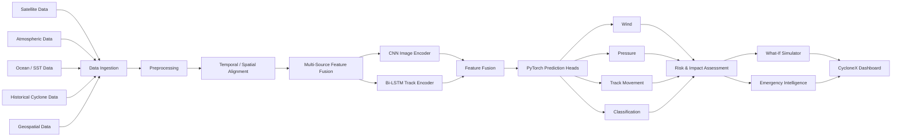

# CycloneX

**AI-Powered Cyclone Intelligence & Emergency Decision-Support System**

**Smart India Hackathon 2026**  
**Problem Statement ID:** SIH26070  
**Theme:** Disaster Management  
**Category:** Software  
**Team:** The Apex Crew  

---

## 1. SIH Problem Statement

> "To develop an Artificial Intelligence (AI) / Machine Learning (ML) based system for identification, classification, and prediction of different tropical cyclone patterns using multi-source satellite data."

---

## 2. Problem Understanding

Tropical cyclones are highly complex meteorological phenomena. Traditional forecasting relies on human interpretation of satellite imagery and computationally intensive numerical weather prediction (NWP) models.

The core challenge is to synthesize heterogeneous, high-dimensional data—including satellite imagery, atmospheric conditions, oceanic conditions, and historical cyclone tracks—into a unified intelligence pipeline that can support rapid cyclone identification, classification, prediction, risk assessment, and emergency decision-making.

CycloneX addresses this challenge by combining multi-source environmental intelligence with a CNN + Bi-LSTM machine-learning architecture and an interactive emergency decision-support platform.

---

## 3. Proposed Solution

CycloneX is an end-to-end cyclone intelligence and emergency decision-support platform.

The system combines:

* Satellite observations and imagery
* Atmospheric and weather data
* Sea Surface Temperature (SST)
* Historical cyclone tracks
* Geospatial information
* AI/ML-based cyclone analysis
* Risk and exposure assessment
* What-If scenario simulation
* Emergency decision-support intelligence

The platform follows the workflow:

**Observe → Analyze → Predict → Simulate → Assess Risk → Prepare**

The objective is to bridge the gap between raw meteorological data and actionable disaster-management intelligence.

---

## 4. Key Features

* **Interactive 2D/3D Cyclone Map** — Leaflet and React Globe visualization.
* **REAL DATA Mode** — Separates actual connected data sources from demonstration data.
* **DEMO REPLAY Mode** — Historical Cyclone Michaung scenario for reliable presentation and testing.
* **Multi-Source Data Fusion** — Combines satellite, atmospheric, oceanic, historical and geospatial information.
* **PyTorch AI/ML Pipeline** — CNN + Bi-LSTM architecture for cyclone analysis.
* **Cyclone Classification** — Seven-class cyclone intensity classification output.
* **Intensity Prediction** — AI prediction of wind speed and central pressure.
* **One-Step Track Prediction** — AI prediction of ΔLatitude and ΔLongitude.
* **Observed vs Forecast vs AI Track** — Clearly separates different prediction sources.
* **Risk Assessment** — Evaluates wind, flooding, storm-surge and infrastructure-related risks.
* **India Impact Intelligence** — Supports analysis of potential exposure of Indian coastal regions.
* **What-If Simulator** — Allows hypothetical changes to cyclone intensity and movement.
* **Scenario-Based Risk Analysis** — Recalculates potential exposure under user-defined scenarios.
* **Emergency Intelligence** — Generates decision-support recommendations for evacuation, medical response, shelters, communications and logistics.
* **Data Source & Freshness Indicators** — Clearly identifies LIVE, SAMPLE, FALLBACK and DEMO data states.
* **Cloud Deployment** — Vercel frontend with production backend services.

---

## 5. Multi-Source Intelligence

CycloneX is designed around multi-source environmental intelligence.

The system combines:

| Data Source | Purpose |
| --- | --- |
| Satellite imagery | Cyclone structure and cloud-pattern analysis |
| Atmospheric/weather data | Wind, pressure, temperature, humidity and environmental context |
| Ocean/SST data | Oceanic thermal conditions relevant to cyclone development |
| Historical cyclone tracks | Historical context and validation |
| Geospatial data | Coastal exposure and infrastructure analysis |
| AI/ML model | Intensity, movement and classification prediction |

The combined information is transformed into model-ready features and passed through the CycloneX AI/ML pipeline.

---

## 6. Satellite Data

### Current Satellite Integration

**Provider:** NASA GIBS (Global Imagery Browse Services)

**Products:**
* Terra MODIS
* Aqua MODIS

**Purpose:**
* Historical satellite visualization
* Cloud-pattern observation
* Cyclone structure visualization
* Demonstration of satellite-data processing workflows

The current satellite visualization uses historical imagery associated with the Cyclone Michaung 2023 demonstration scenario.

Satellite imagery displayed as historical/demo data is explicitly labelled and is not represented as a live INSAT feed.

### Planned / Future Operational Satellite Integration

The architecture is designed to support authenticated satellite sources such as INSAT-3D/3DR/3DS when authorized access is available.

CycloneX does **not** claim live INSAT/MOSDAC integration unless an authenticated operational data connection is actually active.

---

## 7. Ocean / SST Data

**Provider:** Copernicus Marine

CycloneX integrates Sea Surface Temperature information as an environmental input.

The relevant Copernicus Marine SST product provides analysed SST values that can be converted from Kelvin to Celsius for application-level visualization.

SST is used as an environmental variable in cyclone analysis and risk interpretation.

Credentials, when required, are kept on the backend and are never exposed through frontend environment variables.

---

## 8. Atmospheric / Weather Data

**Provider:** Open-Meteo

CycloneX uses atmospheric and weather information such as:

* Wind speed
* Wind gusts
* Surface pressure
* Temperature
* Relative humidity
* Marine/coastal environmental variables where applicable

Open-Meteo is used as a real-time/near-real-time environmental data source where supported by the API.

Data freshness and source state are displayed by the application.

---

## 9. Historical Cyclone Data

**Provider:** NOAA IBTrACS

IBTrACS provides historical tropical cyclone best-track information.

CycloneX uses historical cyclone information for:

* Historical context
* Track analysis
* Model validation
* Cyclone analog analysis
* Demonstration scenarios

Historical data is kept separate from live operational observations.

---

## 10. AI / ML Architecture

CycloneX contains a PyTorch-based multimodal neural-network architecture.

The model combines:

**Satellite Image Encoder**  
→ CNN-based spatial feature extraction

**Track Encoder**  
→ Bi-LSTM temporal feature extraction

**Feature Fusion**  
→ Combines satellite and historical track representations

**Prediction Heads**  
→ Wind prediction  
→ Pressure prediction  
→ Track movement prediction  
→ Cyclone classification  

### Model Architecture

```text
Satellite Input
4 Channels
    │
    ▼
CNN Image Encoder
    │
    ▼
256-D Image Features
    │
    │
    ├──────────────┐
                   │
Historical Track  │
9 × 5 Features    │
    │              │
    ▼              │
Bi-LSTM Encoder    │
    │              │
    ▼              │
128-D Track        │
Features           │
    │              │
    └──────┬───────┘
           ▼
     Feature Fusion
           │
           ▼
     Shared Neural
     Representation
           │
     ┌─────┼──────────────┐
     ▼     ▼              ▼
   Wind  Pressure     Track ΔLat/ΔLon
                         │
                         ▼
                    Classification
```

The implemented model contains approximately 2.76 million trainable parameters.

---

## 11. Model Inputs

The current model architecture expects:

### Satellite Input
* 4-channel satellite tensor
* Spatial satellite image representation

### Historical Track Input
* 9 sequential observations
* 5 features per observation

The exact preprocessing, normalization and tensor construction must remain consistent with the trained model.

CycloneX does not treat arbitrary random tensors or synthetic values as real satellite inference.

---

## 12. AI Outputs

The current PyTorch model produces:

### Intensity
* Predicted wind speed
* Predicted central pressure

### Movement
* One-step ΔLatitude
* One-step ΔLongitude

### Classification
* Seven-class cyclone category output

The current model produces a **one-step movement prediction**.

It should not be represented as a scientifically validated 24-hour or 48-hour AI forecast unless a separately validated multi-step forecasting system is implemented.

---

## 13. Detection

Cyclone detection combines available environmental and satellite-derived information to identify cyclone-like systems.

The architecture supports features related to:

* Cloud structure
* Temperature patterns
* Atmospheric conditions
* Cyclone organization
* Environmental context

Detection outputs are intended as decision-support information and are not a replacement for official meteorological detection or warnings.

---

## 14. Classification

CycloneX includes a seven-class classification head in the PyTorch model.

The classification output is intended to represent cyclone intensity categories derived from the model's training configuration.

Official meteorological terminology and classification thresholds should be applied according to the relevant meteorological authority when presenting operational information.

---

## 15. Intensity Prediction

The AI pipeline predicts cyclone intensity-related variables including:

* Wind speed
* Central pressure

Environmental variables such as SST and atmospheric conditions provide additional context for cyclone analysis.

These predictions are model outputs and should not be interpreted as official forecasts.

---

## 16. Track Prediction

The current AI model provides:

* ΔLatitude
* ΔLongitude

This represents a **one-step movement prediction**.

CycloneX separately distinguishes:

1. **Observed Track**
2. **Official/External Forecast Track**, when available
3. **AI Predicted Movement**
4. **User-Defined What-If Scenario Track**

These sources must never be visually or semantically presented as equivalent.

---

## 17. REAL DATA vs DEMO REPLAY

CycloneX has two explicitly separated operating modes.

### REAL DATA

REAL DATA mode uses connected external data sources such as:

* Open-Meteo
* Copernicus Marine
* Historical cyclone datasets
* Other authenticated sources when available

The system displays the actual availability and freshness of connected sources.

If a source is unavailable, the system must display an appropriate fallback/offline state rather than silently presenting demo information as live data.

### DEMO REPLAY

DEMO REPLAY provides a controlled historical demonstration using the Cyclone Michaung 2023 scenario.

It is designed to guarantee a reproducible presentation even when live data sources are unavailable.

Demo information is explicitly labelled as historical/demo information.

---

## 18. Data Status Semantics

CycloneX uses explicit data-status states.

### LIVE
The system is currently receiving data from the configured external source.

### SAMPLE
Data is representative/sample information and is not being presented as a live observation.

### FALLBACK
The primary source is unavailable and a predefined fallback is being used.

### DEMO
The information belongs to the historical demonstration/replay environment.

### OFFLINE
The requested service or model is currently unavailable.

CycloneX does not silently convert fallback or demo data into LIVE data.

---

## 19. End-to-End Architecture


```mermaid
flowchart LR
    A[Satellite Data] --> F[Data Ingestion]
    B[Atmospheric Data] --> F
    C[Ocean / SST Data] --> F
    D[Historical Cyclone Data] --> F
    E[Geospatial Data] --> F

    F --> G[Preprocessing]
    G --> H[Temporal / Spatial Alignment]
    H --> I[Multi-Source Feature Fusion]

    I --> J[CNN Image Encoder]
    I --> K[Bi-LSTM Track Encoder]

    J --> L[Feature Fusion]
    K --> L

    L --> M[PyTorch Prediction Heads]

    M --> N[Wind]
    M --> O[Pressure]
    M --> P[Track Movement]
    M --> Q[Classification]

    N --> R[Risk & Impact Assessment]
    O --> R
    P --> R
    Q --> R

    R --> S[What-If Simulator]
    R --> T[Emergency Intelligence]

    S --> U[CycloneX Dashboard]
    T --> U
```

---

## 20. Production Deployment Architecture

CycloneX separates the frontend, application backend and ML inference service.

```text
                    ┌─────────────────────┐
                    │   Vercel Frontend   │
                    │ React + TypeScript   │
                    └──────────┬──────────┘
                               │ HTTPS
                               ▼
                    ┌─────────────────────┐
                    │ Node / Express API  │
                    │   Production API    │
                    └──────────┬──────────┘
                               │ HTTPS
                               ▼
                    ┌─────────────────────┐
                    │ FastAPI ML Service  │
                    │   PyTorch Model     │
                    └──────────┬──────────┘
                               │
                               ▼
                    ┌─────────────────────┐
                    │ Actual Model        │
                    │ CNN + Bi-LSTM       │
                    └─────────────────────┘
```

The production frontend must not depend on localhost.

The ML service exposes health and model-status endpoints so the UI can accurately display whether the model is actually available.

---

## 21. Model Availability

CycloneX follows strict model-status semantics.

When the model is unavailable:

```text
AI Predict Wind
--

AI Predict Pres
--

AI Movement
--

Model Status
OFFLINE
```

When the actual PyTorch model is successfully loaded and reachable:

```text
AI Predict Wind
<actual model output>

AI Predict Pres
<actual model output>

AI Movement
<actual ΔLat / ΔLon>

Model Status
ONLINE

PyTorch Model
ONLINE
```

The application must never display `ONLINE` merely because the backend server is running.

---

## 22. Risk / Impact Assessment

CycloneX converts cyclone intelligence into localized decision-support information.

Risk analysis considers available:

* Wind hazard
* Rainfall/flooding relevance
* Storm-surge relevance
* Coastal exposure
* Infrastructure exposure
* Geographic proximity
* Cyclone intensity
* Cyclone movement
* Environmental conditions

The system distinguishes between **hazard**, **exposure**, and **risk** wherever sufficient data is available.

Risk outputs are decision-support indicators rather than official disaster warnings.

---

## 23. India Impact Intelligence

CycloneX is designed to answer:

* Where is the cyclone?
* How strong is it?
* Where has it moved from?
* Where is it moving?
* What does the AI predict next?
* Could the system affect India?
* Which coastal regions may be exposed?
* What hazards may become relevant?
* What emergency-preparedness actions may need consideration?
* Which data sources and timestamps support the analysis?

Potentially exposed locations can include:

* Coastal regions
* Cities
* Ports
* Airports
* Hospitals
* Critical infrastructure

Only data actually available to the system should be presented as factual exposure information.

---

## 24. What-If Simulator

The What-If Simulator is a central decision-support component of CycloneX.

It allows users to modify a hypothetical scenario such as:

* Cyclone track movement
* Intensity
* Coastward/seaward movement

The system then recalculates scenario-dependent information.

Possible outputs include:

* Potentially affected regions
* Distance to coastline
* Coastal exposure
* Cities
* Ports
* Airports
* Hospitals
* Critical infrastructure
* Hazard relevance
* Emergency-preparedness implications

The simulator clearly labels modified conditions as:

**USER SCENARIO / WHAT-IF**

A user-created scenario is never presented as an official forecast.

---

## 25. Baseline vs Scenario Analysis

CycloneX supports comparison between:

### Baseline
The currently observed/modelled cyclone state.

### What-If Scenario
A user-defined hypothetical modification.

This allows decision-makers to understand how changes in cyclone movement or intensity could alter potential exposure and preparedness requirements.

The Emergency Intelligence layer consumes the scenario state so that recommendations can change when the user changes the scenario.

---

## 26. Emergency Intelligence

The **AI Disaster Commander** converts cyclone and risk information into structured emergency decision-support categories.

These can include:

* Evacuation
* Medical preparedness
* Shelter readiness
* Communication
* Logistics
* Infrastructure preparedness

Recommendations are generated from available cyclone intelligence and risk information.

The system is intended to support authorized disaster-management personnel and does not replace official emergency-management directives.

---

## 27. Interactive Map

CycloneX provides an interactive geographic interface with:

* 2D Leaflet map
* 3D globe visualization
* Cyclone locations
* Observed tracks
* Forecast tracks when available
* AI movement prediction
* India impact information
* Environmental information
* Replay controls
* Scenario visualization
* Location-based analysis

The map is designed around the operational workflow:

**Locate → Understand → Predict → Assess → Act**

---

## 28. Observed vs Forecast vs AI

CycloneX maintains clear visual separation between different track types.

Example conceptual representation:

```text
Observed Track:
●━━●━━●━━●

Forecast Track:
┄┄●┄┄●┄┄●

AI One-Step Prediction:
        ● → AI movement

What-If Scenario:
        ○━━○━━○
```

Official/external forecast information, AI prediction and user-generated scenarios are never treated as interchangeable.

---

## 29. Data Pipeline

The application follows the following conceptual pipeline:

```text
Raw Data
   ↓
Validation
   ↓
Radiometric / Numerical Preprocessing
   ↓
Spatial Alignment
   ↓
Temporal Alignment
   ↓
Feature Extraction
   ↓
Multi-Source Fusion
   ↓
CNN + Bi-LSTM
   ↓
AI Outputs
   ↓
Risk / Exposure Analysis
   ↓
What-If Simulation
   ↓
Emergency Intelligence
   ↓
Dashboard
```

---

## 30. Technology Stack

### Frontend
* React
* TypeScript
* Vite
* Tailwind CSS
* Lucide Icons
* Recharts
* Leaflet
* React-Leaflet
* React Globe GL

### Backend
* Node.js
* Express
* Axios

### ML Backend
* Python
* FastAPI
* PyTorch

### Data Sources
* Copernicus Marine
* Open-Meteo
* NOAA IBTrACS
* NASA GIBS
* Additional authenticated meteorological/satellite sources when authorized

---

## 31. Repository Structure

```text
CycloneX/
│
├── backend/
│   ├── ml/
│   │   ├── api.py
│   │   ├── predictor.py
│   │   └── requirements.txt
│   │
│   └── server.js
│
├── src/
│   ├── components/
│   │   ├── AIDisasterCommander.tsx
│   │   ├── CommunicationRisk.tsx
│   │   ├── CycloneAnalysisPanel.tsx
│   │   ├── CycloneMap.tsx
│   │   ├── DataSourcesPanel.tsx
│   │   ├── EvacuationShelter.tsx
│   │   ├── GlobeMap.tsx
│   │   ├── HospitalPreparedness.tsx
│   │   ├── MLPipelinePanel.tsx
│   │   ├── PredictionPanel.tsx
│   │   ├── RiskAssessmentPanel.tsx
│   │   └── WhatIfSimulator.tsx
│   │
│   ├── context/
│   ├── services/
│   ├── data/
│   └── types/
│
├── package.json
├── vite.config.*
└── README.md
```

---

## 32. Environment Variables

Production services use environment variables for external service configuration.

Typical backend configuration includes:

```text
MODEL_PATH=
MODEL_DOWNLOAD_URL=

ML_SERVICE_URL=
FRONTEND_ORIGIN=

COPERNICUSMARINE_SERVICE_USERNAME=
COPERNICUSMARINE_SERVICE_PASSWORD=
```

Frontend configuration includes:

```text
VITE_API_BASE_URL=
```

Sensitive credentials must remain server-side.

`.env` files must not be committed to the repository.

---

## 33. Installation

### Frontend

```bash
npm install
npm run dev
```

### Node Backend

```bash
node backend/server.js
```

The local Node API runs on port `8000` by default.

### Python ML Backend

From `backend/ml`:

```bash
pip install -r requirements.txt
uvicorn api:app --host 0.0.0.0 --port 8001
```

The Python service provides the PyTorch inference API.

---

## 34. Production Deployment

### Frontend
The React/Vite frontend is deployed through Vercel.

### Application Backend
The Node/Express backend is deployed as a production web service.

### ML Backend
The FastAPI/PyTorch service is deployed separately as a production web service.

This separation avoids coupling a large PyTorch runtime to the frontend deployment environment and allows the model to be loaded independently.

---

## 35. Validation

CycloneX is designed to support validation against historical best-track information such as NOAA IBTrACS.

Validation should evaluate model outputs using appropriate scientific metrics rather than treating training/validation loss as prediction accuracy.

Relevant future evaluation metrics include:

* Track error
* Position error
* Wind prediction error
* Pressure prediction error
* Classification accuracy
* Precision / recall / F1
* Calibration and uncertainty evaluation

The current system should be treated as an AI/ML prototype until comprehensive scientific validation has been completed.

---

## 36. Current Status

CycloneX currently provides:

* Interactive 2D/3D visualization
* REAL DATA and DEMO REPLAY separation
* Environmental data ingestion
* Historical cyclone context
* PyTorch model architecture
* AI prediction API architecture
* Risk assessment
* What-If simulation
* Emergency Intelligence
* Production-ready frontend/backend separation

The AI outputs are displayed as unavailable when the production model service is not connected or the required model inputs are unavailable.

The project does not fabricate AI outputs to make the system appear operational.

---

## 37. Limitations

* The current AI model is an initial machine-learning implementation and requires further scientific validation.
* The current AI movement output is one-step ΔLatitude/ΔLongitude rather than a validated multi-day forecast.
* Historical satellite visualization currently relies on NASA GIBS imagery for demonstration.
* Live operational INSAT/MOSDAC integration requires authorized access and is not claimed unless actually connected.
* Environmental data availability depends on the connected external services.
* Risk and exposure outputs depend on the availability and quality of underlying geographic and environmental data.
* What-If scenarios are hypothetical decision-support scenarios and are not official forecasts.
* The system does not replace official meteorological warnings, forecasts or disaster-management directives.

---

## 38. Future Scope

Potential future development includes:

* Authenticated operational INSAT satellite integration
* Higher-resolution multi-source satellite ingestion
* More extensive Copernicus Marine integration
* Multi-step cyclone track forecasting
* Probabilistic prediction and uncertainty estimation
* Larger-scale historical model training
* Advanced geospatial exposure datasets
* Automated model validation against IBTrACS
* Real-time cyclone detection
* More comprehensive NWP integration
* Advanced emergency-resource optimization
* Additional disaster-management integrations

---

## 39. Innovation

CycloneX combines meteorological intelligence with emergency decision support rather than treating cyclone prediction as an isolated ML task.

The platform connects:

```text
Observe
   ↓
Analyze
   ↓
Predict
   ↓
Simulate
   ↓
Assess Risk
   ↓
Prepare
```

Its key innovation is the connection between:

**Multi-Source Environmental Intelligence**  
→ **AI/ML Prediction**  
→ **Geospatial Risk Assessment**  
→ **What-If Simulation**  
→ **Emergency Decision Support**  

This creates a single operational workflow from environmental observation to preparedness analysis.

---

## 40. SIH Requirement Mapping

| SIH Requirement | CycloneX Component |
| --- | --- |
| Identification | Satellite and environmental analysis |
| Classification | PyTorch classification head |
| Prediction | Wind, pressure and one-step movement prediction |
| Multi-source satellite data | Satellite ingestion and preprocessing architecture |
| Historical analysis | NOAA IBTrACS |
| Ocean intelligence | Copernicus Marine SST |
| Atmospheric intelligence | Open-Meteo |
| Visualization | Interactive 2D/3D cyclone map |
| Risk assessment | Risk & Impact Engine |
| Decision support | AI Disaster Commander |
| Scenario analysis | What-If Simulator |

---

## 41. Research & References

CycloneX is informed by established concepts in:

* Tropical cyclone analysis
* Satellite-based cyclone observation
* Dvorak-style satellite interpretation
* Meteorological cyclone classification
* Historical best-track analysis
* Deep-learning image classification
* Recurrent neural networks
* Geospatial risk assessment
* Disaster-management decision support

Primary data-source references include:

* NOAA IBTrACS
* Copernicus Marine
* Open-Meteo
* NASA GIBS

Official meteorological agencies remain the authoritative sources for operational warnings and forecasts.

---

## 42. Security & Data Integrity

CycloneX follows these principles:

* No credentials in frontend code
* No credentials committed to Git
* Backend-only handling of private API credentials
* Explicit source attribution
* Explicit LIVE/SAMPLE/DEMO/OFFLINE status
* No fabricated model availability
* No fabricated AI predictions
* No silent fallback from live data to demo data
* Clear separation between official forecasts, AI predictions and user scenarios

---

## 43. Disclaimer

CycloneX is a Smart India Hackathon prototype intended for academic, research, demonstration and decision-support purposes.

AI predictions, risk indicators, scenario outputs and affected-area estimates generated by the system are not official meteorological forecasts or warnings and should not be used as a substitute for information issued by authorized meteorological and disaster-management authorities.

Final operational decisions must remain with authorized disaster-management officials.

---

## 44. Data Attribution

* **Weather / Atmospheric Data:** Open-Meteo
* **Ocean / SST Data:** Copernicus Marine
* **Historical Cyclone Data:** NOAA IBTrACS
* **Satellite Imagery:** NASA GIBS / NASA EOSDIS
* **Geographic Base Map:** OpenStreetMap where applicable

Source and timestamp information should be displayed by the application wherever applicable.

---

## 45. Demo Instructions

### DEMO REPLAY

1. Open CycloneX.
2. Select **DEMO REPLAY**.
3. Select the historical Cyclone Michaung scenario.
4. Use the replay controls to observe the cyclone timeline.
5. Inspect satellite imagery, track, intensity and risk information.
6. Open the What-If Simulator.
7. Modify the hypothetical track or intensity.
8. Observe the resulting scenario and emergency-intelligence changes.

### REAL DATA

1. Select **REAL DATA**.
2. Allow the application to retrieve configured external data.
3. Inspect source-status indicators.
4. Review environmental conditions.
5. Inspect available cyclone intelligence.
6. Review AI predictions only when the actual PyTorch model is online and valid model inputs are available.
7. Use the What-If Simulator for hypothetical scenario analysis.

---

## 46. Project Philosophy

CycloneX is designed around one principle:

> **Do not hide uncertainty. Make the source, model state, prediction type and data freshness visible to the decision-maker.**

The system therefore distinguishes:

**Observed Data**  
from  
**External Forecasts**  
from  
**AI Predictions**  
from  
**User-Generated Scenarios**  

This distinction is fundamental to responsible AI-assisted disaster management.

---

<div align="center">

### 🌪️ CycloneX

**AI-Powered Cyclone Intelligence & Emergency Decision-Support System**

Built for **Smart India Hackathon 2026**

**Team: The Apex Crew**

**Problem Statement: SIH26070**

**Observe → Analyze → Predict → Simulate → Assess Risk → Prepare**

</div>
